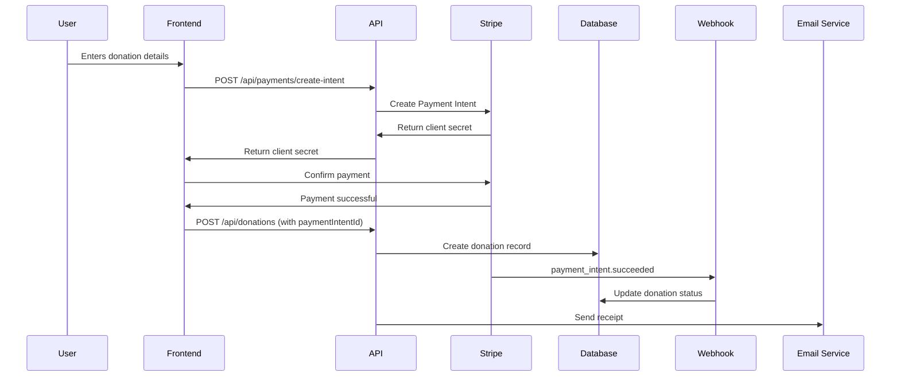

# Stripe Integration Guide

Rally now supports real payment processing through Stripe! This guide covers setup, testing, and production deployment.

## Table of Contents

1. [Quick Start](#quick-start)
2. [API Keys Setup](#api-keys-setup)
3. [Webhook Configuration](#webhook-configuration)
4. [Testing Payments](#testing-payments)
5. [Stripe Connect Setup](#stripe-connect-setup)
6. [Production Deployment](#production-deployment)
7. [API Reference](#api-reference)

---

## Quick Start

### 1. Install Dependencies (Already Done)

The Stripe packages are already installed:
- `stripe` - Server-side SDK
- `@stripe/stripe-js` - Client-side SDK
- `@stripe/react-stripe-js` - React components

### 2. Get Your API Keys

1. Sign up for a Stripe account at https://stripe.com
2. Go to https://dashboard.stripe.com/test/apikeys
3. Copy your **Publishable key** (starts with `pk_test_`)
4. Click "Reveal test key" and copy your **Secret key** (starts with `sk_test_`)

### 3. Update Environment Variables

Edit `.env` and replace the placeholder values:

```bash
STRIPE_SECRET_KEY="sk_test_YOUR_ACTUAL_KEY"
NEXT_PUBLIC_STRIPE_PUBLISHABLE_KEY="pk_test_YOUR_ACTUAL_KEY"
STRIPE_WEBHOOK_SECRET="whsec_YOUR_WEBHOOK_SECRET"  # We'll get this next
```

**Important:** The publishable key must have the `NEXT_PUBLIC_` prefix to be available in the browser.

---

## Webhook Configuration

Webhooks allow Stripe to notify your app about payment events in real-time.

### Local Development (Using Stripe CLI)

1. **Install Stripe CLI:**
   ```bash
   # macOS
   brew install stripe/stripe-cli/stripe

   # Linux
   wget https://github.com/stripe/stripe-cli/releases/download/v1.19.4/stripe_1.19.4_linux_x86_64.tar.gz
   tar -xvf stripe_1.19.4_linux_x86_64.tar.gz
   sudo mv stripe /usr/local/bin
   ```

2. **Login to Stripe:**
   ```bash
   stripe login
   ```

3. **Forward webhooks to your local server:**
   ```bash
   stripe listen --forward-to localhost:3000/api/webhooks/stripe
   ```

4. **Copy the webhook signing secret** (starts with `whsec_`) and add it to `.env`:
   ```bash
   STRIPE_WEBHOOK_SECRET="whsec_..."
   ```

### Production Webhooks

1. Go to https://dashboard.stripe.com/webhooks
2. Click **Add endpoint**
3. Enter your production URL: `https://yourdomain.com/api/webhooks/stripe`
4. Select the following events:
   - `payment_intent.succeeded`
   - `payment_intent.payment_failed`
   - `charge.refunded`
   - `account.updated`
5. Click **Add endpoint**
6. Click **Reveal** under "Signing secret" and add it to your production `.env`

---

## Testing Payments

### Test Card Numbers

Use these card numbers in test mode:

| Card Number | Description |
|------------|-------------|
| `4242 4242 4242 4242` | Successful payment |
| `4000 0025 0000 3155` | Requires authentication (3D Secure) |
| `4000 0000 0000 9995` | Payment fails |

- Use any future expiration date (e.g., 12/34)
- Use any 3-digit CVC
- Use any valid ZIP code

### Testing the Flow

1. **Start your dev server:**
   ```bash
   npm run dev
   ```

2. **In another terminal, start webhook forwarding:**
   ```bash
   stripe listen --forward-to localhost:3000/api/webhooks/stripe
   ```

3. **Test a donation:**
   - Navigate to a campaign page
   - Click "Donate"
   - Enter donation amount
   - Use test card `4242 4242 4242 4242`
   - Complete the payment

4. **Check the webhook events:**
   - You should see events in your Stripe CLI terminal
   - Check your app's console for "Payment succeeded" logs

---

## Stripe Connect Setup

Stripe Connect allows campaigns to receive payouts directly to their bank accounts.

### How It Works

1. Campaign leader creates a campaign
2. Campaign leader clicks "Set up payouts" in campaign settings
3. They're redirected to Stripe Connect onboarding
4. They provide bank account details and verify identity
5. Once approved, they can request disbursements
6. Bank admin approves disbursement
7. Funds are transferred via Stripe to their bank account

### API Endpoints

**Start Onboarding:**
```typescript
POST /api/stripe-connect/onboard
{
  "campaignId": "campaign_id"
}

Response:
{
  "success": true,
  "onboardingUrl": "https://connect.stripe.com/..."
}
```

**Check Account Status:**
```typescript
GET /api/stripe-connect/status?campaignId=campaign_id

Response:
{
  "success": true,
  "connected": true,
  "chargesEnabled": true,
  "payoutsEnabled": true,
  "detailsSubmitted": true
}
```

**Create Payout:**
```typescript
POST /api/stripe-connect/payout
{
  "disbursementRequestId": "request_id"
}

Response:
{
  "success": true,
  "transferId": "tr_xxx"
}
```

---

## Production Deployment

### Checklist

- [ ] Replace test API keys with live keys (starts with `sk_live_` and `pk_live_`)
- [ ] Set up production webhooks in Stripe dashboard
- [ ] Enable SSL/HTTPS on your domain (required for Stripe)
- [ ] Update `NEXT_PUBLIC_APP_URL` in `.env` to your production URL
- [ ] Test with real bank account (use small amount)
- [ ] Review Stripe's compliance requirements for your region
- [ ] Set up proper error logging and monitoring

### Live API Keys

1. Go to https://dashboard.stripe.com/apikeys (without `/test/`)
2. **Activate your account** if you haven't already
3. Copy your live publishable and secret keys
4. Update your production environment variables

### Important Notes

⚠️ **Never commit API keys to version control**
⚠️ **Always use HTTPS in production** (Stripe requires it)
⚠️ **Test thoroughly before going live**

---

## API Reference

### Payment Flow



### Frontend Integration Example

```tsx
'use client';

import { useState, useEffect } from 'react';
import { Elements, PaymentElement, useStripe, useElements } from '@stripe/react-stripe-js';
import { getStripe, createPaymentIntent, processDonationWithStripe } from '@/lib/stripe-client';

export default function DonationForm({ campaignId }: { campaignId: string }) {
  const [clientSecret, setClientSecret] = useState('');
  const [paymentIntentId, setPaymentIntentId] = useState('');
  const [amount, setAmount] = useState(50);
  const [email, setEmail] = useState('');

  const stripePromise = getStripe();

  const handleCreateIntent = async () => {
    try {
      const { clientSecret, paymentIntentId } = await createPaymentIntent({
        campaignId,
        amount,
        donorEmail: email,
      });
      setClientSecret(clientSecret);
      setPaymentIntentId(paymentIntentId);
    } catch (error) {
      console.error('Failed to create payment intent:', error);
    }
  };

  return (
    <div>
      <input
        type="number"
        value={amount}
        onChange={(e) => setAmount(Number(e.target.value))}
        placeholder="Amount"
      />
      <input
        type="email"
        value={email}
        onChange={(e) => setEmail(e.target.value)}
        placeholder="Email"
      />
      <button onClick={handleCreateIntent}>Continue to Payment</button>

      {clientSecret && (
        <Elements stripe={stripePromise} options={{ clientSecret }}>
          <CheckoutForm
            campaignId={campaignId}
            amount={amount}
            email={email}
            paymentIntentId={paymentIntentId}
          />
        </Elements>
      )}
    </div>
  );
}

function CheckoutForm({
  campaignId,
  amount,
  email,
  paymentIntentId,
}: {
  campaignId: string;
  amount: number;
  email: string;
  paymentIntentId: string;
}) {
  const stripe = useStripe();
  const elements = useElements();
  const [loading, setLoading] = useState(false);
  const [error, setError] = useState<string | null>(null);

  const handleSubmit = async (e: React.FormEvent) => {
    e.preventDefault();
    if (!stripe || !elements) return;

    setLoading(true);
    setError(null);

    try {
      const { error: stripeError } = await stripe.confirmPayment({
        elements,
        redirect: 'if_required',
      });

      if (stripeError) {
        setError(stripeError.message || 'Payment failed');
        return;
      }

      // Process donation on backend
      await processDonationWithStripe({
        campaignId,
        amount,
        donorEmail: email,
        paymentIntentId,
      });

      // Redirect to success page
      window.location.href = `/campaigns/${campaignId}/donate/success`;
    } catch (err) {
      setError(err instanceof Error ? err.message : 'Payment failed');
    } finally {
      setLoading(false);
    }
  };

  return (
    <form onSubmit={handleSubmit}>
      <PaymentElement />
      {error && <div className="error">{error}</div>}
      <button type="submit" disabled={!stripe || loading}>
        {loading ? 'Processing...' : `Donate $${amount}`}
      </button>
    </form>
  );
}
```

### Available Endpoints

#### Payments

| Endpoint | Method | Description |
|----------|--------|-------------|
| `/api/payments/create-intent` | POST | Create a payment intent |
| `/api/donations` | POST | Record donation (simulated or Stripe) |
| `/api/webhooks/stripe` | POST | Handle Stripe webhooks |

#### Stripe Connect

| Endpoint | Method | Description |
|----------|--------|-------------|
| `/api/stripe-connect/onboard` | POST | Start Connect onboarding |
| `/api/stripe-connect/status` | GET | Check account status |
| `/api/stripe-connect/payout` | POST | Create payout to campaign |

---

## Fee Structure

Rally's fee structure with Stripe:

- **Platform Fee:** 10% (configurable via `PLATFORM_FEE_PERCENT`)
- **Stripe Processing Fee:** 2.9% + $0.30 per transaction
- **Example:** $100 donation
  - Stripe fee: $3.20
  - Platform fee: $10.00
  - Net to campaign: $86.80

The fees are automatically calculated in `lib/stripe.ts` and recorded in the database.

---

## Troubleshooting

### Common Issues

**"STRIPE_SECRET_KEY is not defined"**
- Make sure you've added the key to `.env`
- Restart your dev server after updating `.env`

**Webhook signature verification failed**
- Make sure `stripe listen` is running
- Check that `STRIPE_WEBHOOK_SECRET` matches the CLI output
- Ensure you're using the raw body (already handled in `/api/webhooks/stripe`)

**Payment succeeds but donation not created**
- Check webhook logs in Stripe CLI
- Verify webhook is hitting `/api/webhooks/stripe`
- Check server console for errors

### Support

- **Stripe Documentation:** https://stripe.com/docs
- **Stripe Support:** https://support.stripe.com
- **Test Cards:** https://stripe.com/docs/testing

---

## Security Best Practices

1. **Never expose secret keys** - Only publishable keys should be in client-side code
2. **Always verify webhooks** - Use signature verification (already implemented)
3. **Use HTTPS in production** - Required by Stripe
4. **Implement rate limiting** - Prevent abuse of payment endpoints
5. **Log all transactions** - For audit trails and debugging
6. **Handle errors gracefully** - Don't expose sensitive error details to users

---

**Need help?** Check the [Stripe documentation](https://stripe.com/docs) or open an issue on GitHub.
